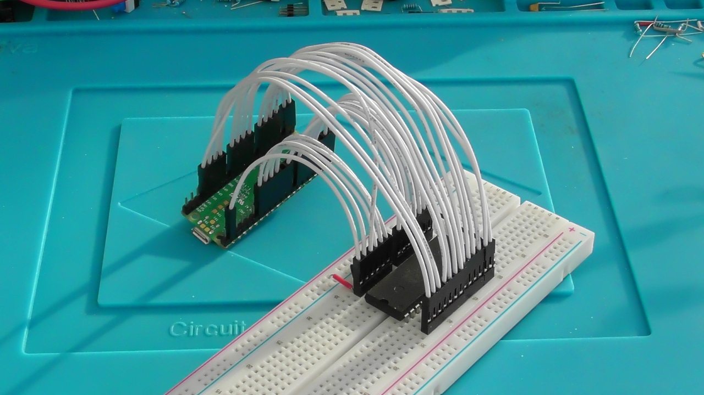

PicoPROM - DIP-EEPROM Programmer based on Raspberry Pi Pico
===========================================================

Writes ROM images to parallel-interface EEPROMs via XMODEM file transfer over USB.

|  | |  |
|:----:|----|:----:|
| Pico connected to EEPROM | | Demo video on YouTube |

Warning
-------
The Raspberry Pi Pico is not 5V-tolerant, but these EEPROMs are 5V devices.
This is fine for write-only access, but it's important to ensure the EEPROM
never writes back to the Pico's GPIO pins.  **Make sure OE is permanently wired
high, to VCC, to prevent this.**

Features
--------

* No additional components are required - just the Pico and the EEPROM
* XMODEM+CRC transfer protocol makes it easy to send files to be written to the EEPROM
* Fast operation - comparable to TL866
* Supports paged writes as well as byte-writes
* Supports write protection

Not features
------------
* Reading back and verifying is not supported and probably won't ever be
* YMODEM, ZMODEM, and other XMODEM extensions aren't supported yet

Binary Installation
-------------------
1. Without an EEPROM connected, hold BOOTSEL and connect the Raspberry Pi Pico
2. Drag picoprom.uf2 into the Raspberry Pi Pico's mass storage window
3. It should then reboot and start communicating over USB Serial

Usage
-----
1. Disconnect the Raspberry Pi Pico from power/USB
2. Wire the Raspberry Pi Pico up to the EEPROM according to the pinout table below
3. Connect the Raspberry Pi Pico to the computer by USB
4. Launch a terminal app with XMODEM support, such as Tera Term, and connect it to the Raspberry Pi Pico
5. Verify that the Raspberry Pi Pico is reporting that it's ready to receive a ROM image
7. Use your terminal to send a ROM image using the XMODEM+CRC protocol
8. Disconnect power before removing the EEPROM from the circuit

Alternatively, instead of starting the XMODEM transfer, press Enter for some configuration options and follow the instructions.

Pinout
------
The pinout is quite straightforward - the pins are laid out around the Pico in almost 
the same arrangement that they appear on the EEPROM, to make it easy and tidy to wire up.

**Make sure OE is connected high, to VCC, as allowing it to float low could cause damage to your Pico.**

| Pico pin | EEPROM pin | Function |      | Pico pin | EEPROM pin | Function |
| -------- |:----------:| -------- | ---- | -------- |:----------:| -------- |
| GP3      | 1  | A14    | | VSYS     | 28 | VCC    |
| GP4      | 2  | A12    | | GND      | 27 | WE     |
| GP5      | 3  | A7     | | GP2      | 26 | A13    |
| GP6      | 4  | A6     | | GP28     | 25 | A8     |
| GP7      | 5  | A5     | | GP27     | 24 | A9     |
| GP8      | 6  | A4     | | GP26     | 23 | A11    |
| GP9      | 7  | A3     | | VSYS     | 22 | OE     |
| GP10     | 8  | A2     | | GP22     | 21 | A10    |
| GP11     | 9  | A1     | | GP21     | 20 | CE     |
| GP12     | 10 | A0     | | GP20     | 19 | D7     |
| GP13     | 11 | D0     | | GP19     | 18 | D6     |
| GP14     | 12 | D1     | | GP18     | 17 | D5     |
| GP15     | 13 | D2     | | GP17     | 16 | D4     |
| GND      | 14 | GND    | | GP16     | 15 | D3     |

### Other options

Depending upon preference, you could swap the CE and WE connections, or connect
them both to GP21.  It doesn't make any difference to the programming
operation, I just chose this layout because it seemed most convenient to me.

If you go further and change the GP pin numbering then you'll need to update
the corresponding array in `picoprom.c`.

Cloning and Building from Source
--------------------------------
1. Set up `pico-sdk` according to the Pico's getting-started guide.
2. Clone this repository alongside `pico-sdk`
3. Create a `build` folder
4. From within the `build` folder, type: `cmake ..`
5. From within the `build` folder, type: `make`

